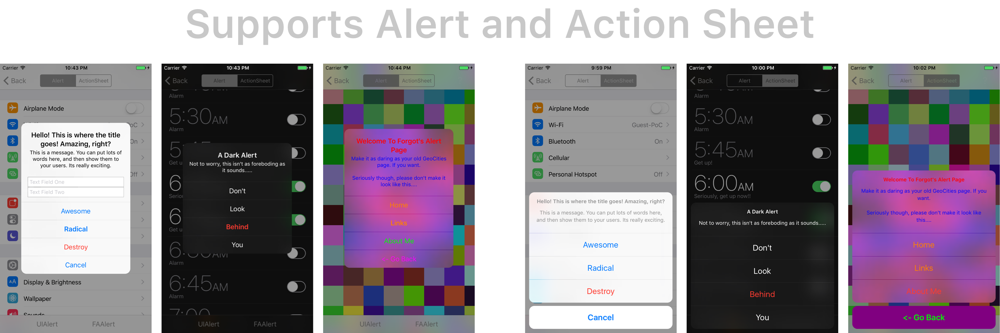

<h1 align="center">
    FAAlertController
</h1>

-------
<p align="center">
    <a href="#features">Features</a> &bull;
    <a href="#installation">Installation</a> &bull;
    <a href="#basic-usage">Basic Usage</a> &bull;
    <a href="#customization">Customization</a>
</p>

-------



## Why?

From Apple's documentation...
>**Subclassing**
The UIAlertController class is intended to be used as-is and does not support subclassing. The view hierarchy for this class is private and must not be modified.

## Features

- Painstakingly designed to mimic UIAlertController as closely as possible in both UI and API design.
- Built in "dark mode".
- Customizable via an appearance delegate.

Additionally, a few unexpected behaviors were identified and fixed. For instance, did you know you can create an alert with a title, message, but *no actions*? While you'll still get an alert, there is no way to dismiss it, forcing your users to exit your app. With **FAAlertController**, configuring an alert or action sheet without any actions automatically allows a user to dismiss it by tapping outside the alert.


## Basic Usage

**FAAlertController** mimics the `UIAlertController` API, so simply use `FAAlertController` and `FAAlertAction` instead.

```swift
// Create an alert
let alert = FAAlertController(title: "Some Title", message: "Your Message Here", preferredStyle: .alert)
// Create an action. All system styles (default, cancel, destructive) are supported.
let awesome = FAAlertAction(title: "Awesome", style: .default, handler: { (action) in
    print("Doing something awesome....")
})
// Add actions and present the alert
alert.addAction(awesome)
present(alert, animated: true, completion: nil)
```

To use the dark version, just change the appearance style in the initializer

```swift
let alert = FAAlertController(title: "A Dark Alert", message: "This isn't as foreboding as it sounds.", preferredStyle: .alert, appearance: .dark)
```

Support for text fields is included as well
```swift
alert.addTextField { (textfield) in
    textfield.placeholder = "Type Something Here!"
}
```

## Customization

To customize the look of your alert, create a type that adopts the `FAAlertControllerAppearanceDelegate`. Customize all your alerts by assigning it to `FAAlertController.globalAppearanceDelegate`, or just one using an individual alert's `appearanceDelegate`. Types assigned to `appearanceDelegate` override the `globalAppearanceDelegate`, and protocol includes a default implementation of all of its properties for both appearance styles. Just tweak what you need and move on, or dig in and make it your own.

```swift
class ViewController: UIViewController, FAAlertControllerAppearanceDelegate {

    let buttonTintColor = .green

    func showAlert() {
        // Create and configure the alert then...
        alert.appearanceDelegate = self
    }

}
```

Take a look in the [Example](https://github.com/forgot/FAAlertController/blob/master/Example/CustomStyleViewController.swift) project for a more complex example.

## Installation

FAAlertController is available through [CocoaPods](https://cocoapods.org/). To install
it, simply add the following line to your Podfile:

    pod "FAAlertController", ~1.0

## License
This project is licensed under the terms of the MIT license. See the LICENSE file.
